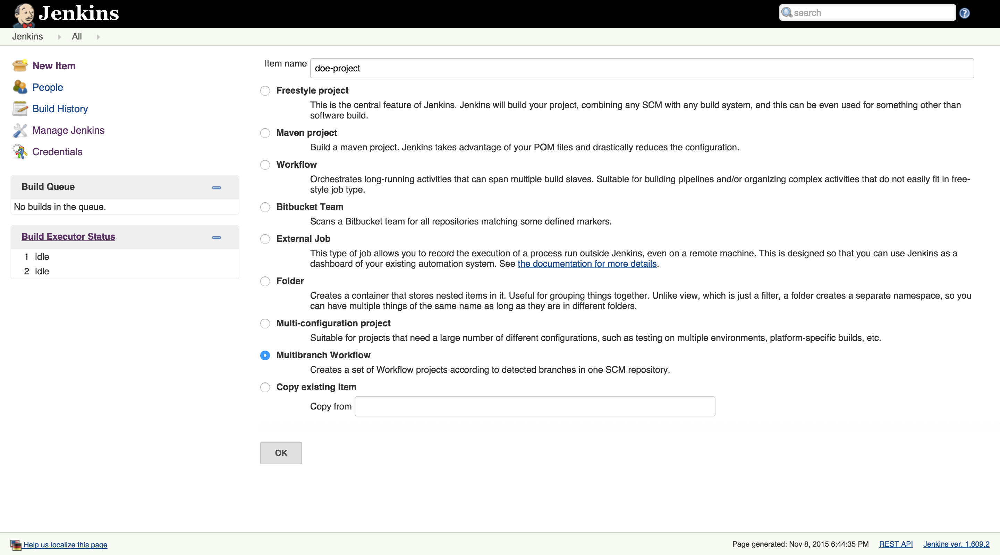
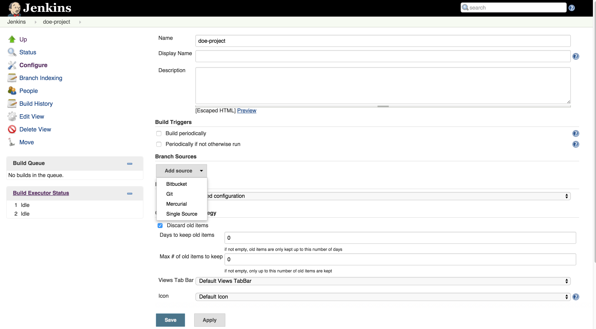
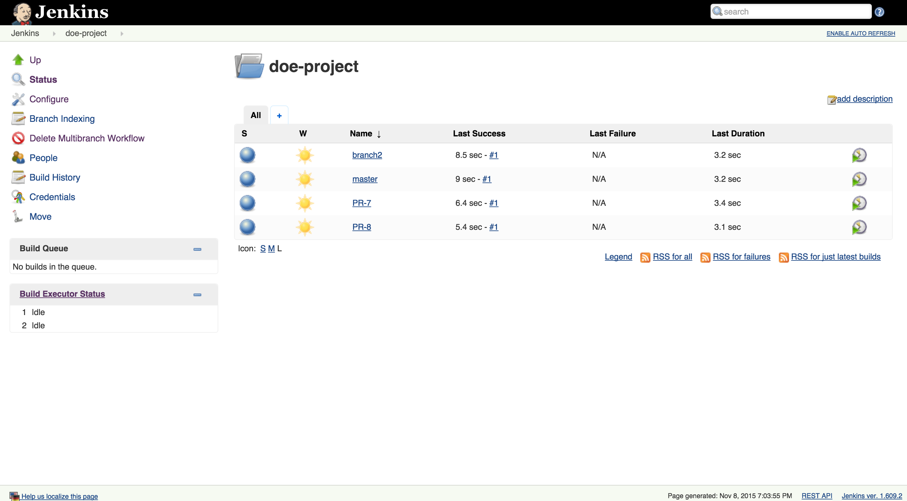
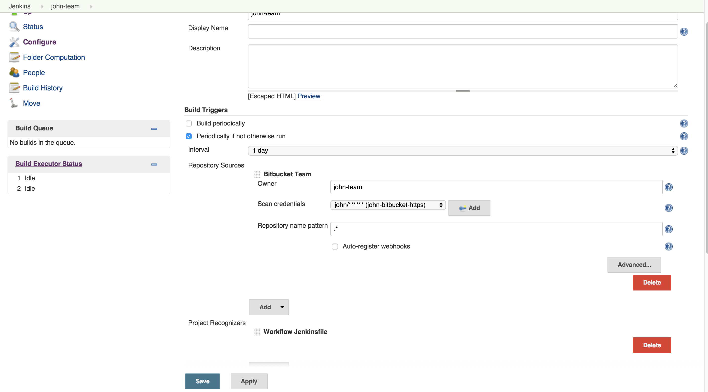
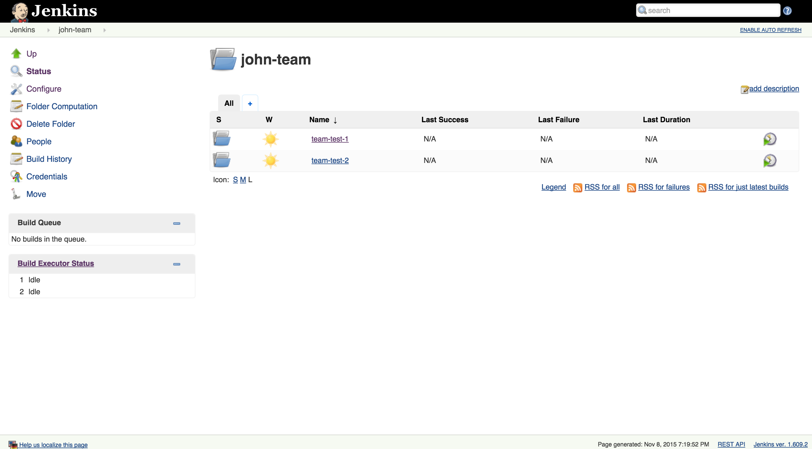
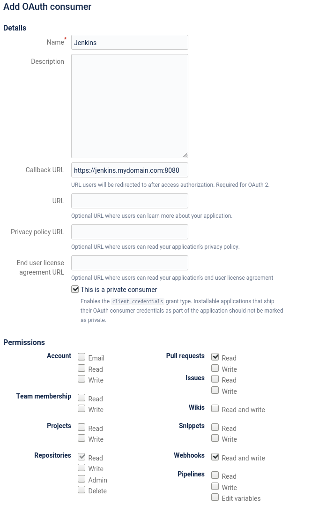
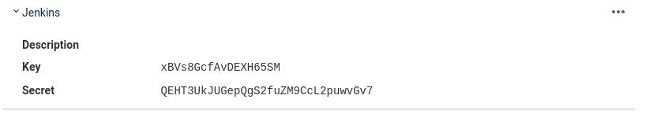
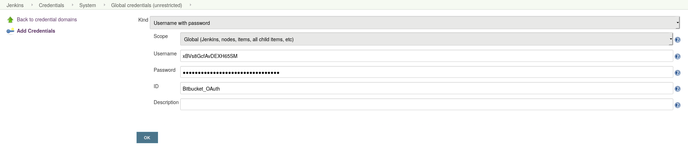

= CloudBees Bitbucket Branch Source plugin

[IMPORTANT]
=====================================================================
On April 29th, 2019, link:https://developer.atlassian.com/cloud/bitbucket/bbc-gdpr-api-migration-guide/[Atlassian updated their suite APIs for both Bitbucket and JIRA] to comply with link:https://eugdpr.org[GDPR privacy requirements]. CloudBees has evaluated this change against the CloudBees BitBucket Branch Source plugin and the CloudBees JIRA plugin.

. BitBucket Cloud Pipeline jobs created with "classic" Jenkins are unaffected.
. There is a limited impact to Bitbucket Cloud Pipeline jobs created using Blue Ocean:
.. If you are running Blue Ocean version 1.15.1 or earlier, you will be unable to create or edit BitBucket Cloud Pipeline jobs.
.. Upgrading to Blue Ocean 1.16.0 or later fixes this issue.
.. However, because "owner name" has been removed from the BitBucket REST API, when you edit Bitbucket Cloud Pipelines in the "classic" Jenkins UI, a UUID (instead of human-readable text) is displayed in the "owner" field of the Pipeline.

We *do not* anticipate any broader user impact. If you encounter a change in behavior that you believe is due to the BitBucket or JIRA API changes, please link:https://support.cloudbees.com/hc/en-us[contact CloudBees Support] for assistance.
=====================================================================

[id=bitbucket-sect-intro]

_CloudBees Bitbucket Branch Source plugin_ (_Bitbucket plugin_ up now) allows use of Bitbucket Cloud and Server
as a multi-branch project source in two different ways:

 * *Single repository source*: automatic creation of jobs for branches and pull requests in a specific repository.
 * *Team/Project folders*: automatic creation of multi-branch projects for each visible repository in a specific Bitbucket Team or Project.

 IMPORTANT: This plugin is not compatible with versions of Bitbucket Server previous to 4.0.

[id=bitbucket-scm-source]
== Branches and pull requests auto-discovering

This plugin adds an additional item in the "Branch Sources" list of multi-branch projects.
Once configured, branches and pull requests are automatically created and built as branches in the multi-branch project.

Follow these steps to create a multi-branch project with Bitbucket as a source:

. Create the multi-branch project. This step depends on which multi-branch plugin is installed.
For example, "Multibranch Pipeline" should be available as project type if Pipeline Multibranch plugin is installed.
+

. Select "Bitbucket" as _Branch Source_
+

. Set credentials to access Bitbucket API and checkout sources (see "Credentials configuration" section below).
. Set the repository owner and name that will be monitored for branches and pull requests.
. If using Bitbucket Server the server base URL needs to be configured (expand the _Advanced_ section to do it).
+
image::images/screenshot-4.png[scaledwidth=90%]

. Finally, save the project. The initial indexing process will run and create projects for branches and pull requests.
+

[id=bitbucket-scm-navigator]
== Team folders

Bitbucket _Team/Project Folders_ project type can be used to automatically track branches and pull requests in all repositories
in a Bitbucket Team or Project.

. Create a project of type _Bitbucket Team/Project_. The project name will be proposed automatically as default _Owner_ (or _Team_) name.
+
image::images/screenshot-6.png[scaledwidth=90%]

. Configure the repository owner (if the proposed value does not match with the actual team or username). It could be:
.. A Bitbucket Cloud Team name: all repositories in the team are imported as Multibranch projects.
.. A Bitbucket Server Project ID: all repositories in the project are imported as Multibranch projects. *Note that the project ID needs to be used instead of the project name*.
.. A regular username: all repositories which the username is owner of are imported.
+

. Save the configuration and an initial indexing process starts, once it finishes a Multibranch
project is created for each repository.
+

[id=bitbucket-webhooks]
== Webhooks registering

The use of https://confluence.atlassian.com/bitbucket/manage-webhooks-735643732.html[Bitbucket webhooks]
allows to trigger builds on branches and pull requests just when a new commit is done. Bitbucket plugin expose a special
service to listen to this webhook requests and acts accordingly by triggering a new reindex and finally
triggering builds on matching branches or pull requests.

For both _Bitbucket Multibranch_ projects and _Bitbucket Team_ projects there is an option in the configuration page
to let Jenkins to automatically register the webhooks in all involved repositories.

image::images/screenshot-4.png[scaledwidth=90%]

IMPORTANT: In order to have the auto-registering process working fine the Jenkins base URL must be
properly configured in _Manage Jenkins_ » _Configure System_

[id=bitbucket-creds-config]
== Credentials configuration

The configuration of Bitbucket plugin (for both _Bitbucket Multibranch_ projects and _Bitbucket Team/Project_) has
two credentials to configure:

. *Scan Credentials*: credentials used to access Bitbucket API in order to discover repositories, branches and pull requests.
If not set then anonymous access is used, so only public repositories, branches and pull requests are discovered and managed. Note that the
Webhooks auto-register feature requires scan credentials to be set. Only HTTP or OAuth credentials are accepted in this field.
. *Checkout Credentials*: credentials used to checkout sources once the repository, branch or pull request is discovered. HTTP, SSH and OAuthcredentials
are allowed. If not set then _Scan Credentials_ are used.

image::images/screenshot-3.png[scaledwidth=90%]

=== OAuth credentials

Bitbucket plugin can make use of OAuth credentials instead of the standard username/password.

First create a new OAuth consumer as instructed in https://confluence.atlassian.com/bitbucket/oauth-on-bitbucket-cloud-238027431.html[Bitbucket OAuth Documentation].
Don't forget to check _This is a private consumer_ and at least allow read access to the repositories and Pull requests. If you want the Bitbucket to install the Webhooks also allow the read and write access of the Webhooks

Then create new _Username with password credentials_, enter the Bitbucket OAuth consumer key in _Username_ field and the Bitbucket OAuth consumer secret in _Password_ field

